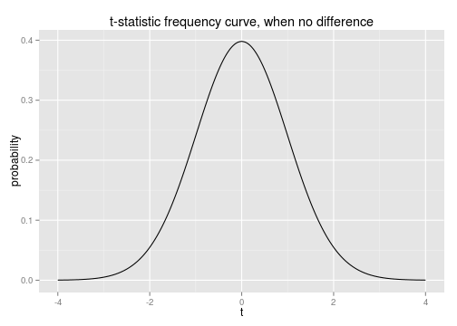
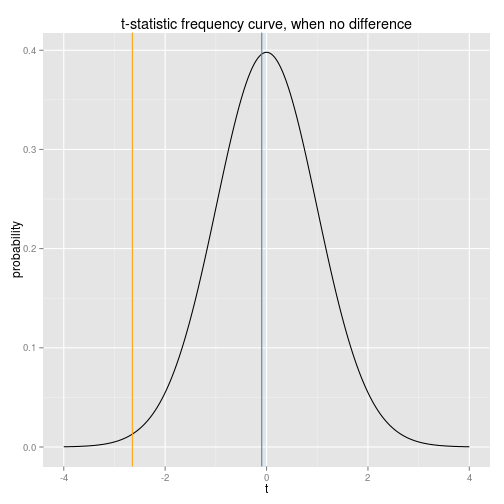

## Introduction to Hypothesis Testing and Linear Regression

---

# Statistical Inference

*Goal*: Test scientific claims and quantify our uncertainty about it.

+ Comparing means between groups: the $t$-test.
    - $p$-values
    - Confidence intervals
+ Associating quantitative variables.
    - Linear regression

All the code for this presentation is available [here](https://github.com/krisrs1128/intro-to-testing)

---
Comparing means
-

- Is the mean of one sample significantly larger than another?
- Apply the hypothesis testing framework.
   + Initially assume there is no difference in means (*Null* hypothesis).
   + Require proof that the difference is nonzero (*Alternative* hypothesis).


```r
head(X.true.diff)
```

```
##         x group
## 1 -0.6339     A
## 2  2.5168     A
## 3 -0.7180     A
## 4 -0.7308     A
## 5  1.0263     A
## 6  0.2749     A
```

---

Simulated data with true difference in means:


---

Simulated data with no difference in means:


--- 
## $t$-test

To quantitatively assess the difference in means, calculate
$$t = \frac{\sqrt{n}\left(\bar{X}_{A} - \bar{X}_{B}\right)}{\sqrt{\widehat{Var{X}}}}.$$

- $n$ is the total number of data points.
- $\bar{X}_{groups}$ is the mean in that group
-  $\widehat{Var{X}}$ is the sample variance, a measure of the "spread" of that group.

---

If there is no difference between the groups, we know the 
distribution of $t$, as long as a few extra assumptions hold, 
- The variances between the two groups are similar.
- Different samples are independent of each other.
- Either data are close to normal (bell-shaped), or there are many (> 30, say) samples.

 

---
## Application to previous data


```r
# True difference
t.test(x ~ group, data = X.true.diff)
```

```
## 
## 	Welch Two Sample t-test
## 
## data:  x by group
## t = -2.647, df = 98, p-value = 0.009463
## alternative hypothesis: true difference in means is not equal to 0
## 95 percent confidence interval:
##  -0.9397 -0.1344
## sample estimates:
## mean in group A mean in group B 
##         -0.1219          0.4152
```

---


```r
# No true difference
t.test(x ~ group, data = X.no.diff)
```

```
## 
## 	Welch Two Sample t-test
## 
## data:  x by group
## t = -0.0945, df = 97.76, p-value = 0.9249
## alternative hypothesis: true difference in means is not equal to 0
## 95 percent confidence interval:
##  -0.4009  0.3645
## sample estimates:
## mean in group A mean in group B 
##         0.02698         0.04520
```

--- 
## Interpretation

+ $p$-value: The probability of a false positive (area under the frequency curve that is more extreme than the observed statistic).
+ Confidence interval: If we repeat the experiment, this (random) interval 
  will contain the true difference in means with 95% probability.
+ Both of these quantities are more informative than simply reporting whether we accept or reject the null hypothesis.

--- 

Visualizing observed $t$-statistics:

 

---


Real world example
-

Data from the [EMI music hackathon](https://www.kaggle.com/c/MusicHackathon).


---


```r
t.test(age ~ music, data = users.impt)
```

```
## 
## 	Welch Two Sample t-test
## 
## data:  age by music
## t = 35.25, df = 1960, p-value < 2.2e-16
## alternative hypothesis: true difference in means is not equal to 0
## 95 percent confidence interval:
##  12.49 13.96
## sample estimates:
## mean in group no.longer.impt      mean in group very.impt 
##                        47.32                        34.09
```

---

Linear Regression
-

- Can we estimate the relationship between variables? (red is truth, blue is an estimate)
- Can we quantify our uncertainty about the estimate, 
  when we don't actually know the truth?


---

## Application to previous data

- The interpretation of $p$-values and confidence intervals remains the same.
- We also have estimates of the slope and intercept for the above line.


```r
XY.model <- lm(y ~ x, data = XY)
summary(XY.model)
```

```
## 
## Call:
## lm(formula = y ~ x, data = XY)
## 
## Residuals:
##    Min     1Q Median     3Q    Max 
## -5.310 -1.128  0.051  1.601  3.154 
## 
## Coefficients:
##             Estimate Std. Error t value Pr(>|t|)    
## (Intercept)    0.649      0.181    3.59  0.00052 ***
## x              1.461      0.169    8.67  9.4e-14 ***
## ---
## Signif. codes:  0 '***' 0.001 '**' 0.01 '*' 0.05 '.' 0.1 ' ' 1
## 
## Residual standard error: 1.81 on 98 degrees of freedom
## Multiple R-squared:  0.434,	Adjusted R-squared:  0.428 
## F-statistic: 75.1 on 1 and 98 DF,  p-value: 9.45e-14
```

---

```r
confint(XY.model)
```

```
##             2.5 % 97.5 %
## (Intercept) 0.290  1.007
## x           1.126  1.796
```

---

Real world application
-

Users answered, on a scale of 0 to 100,
whether "I like to be at the cutting edge of 
new music" and "I like to know about music before
other people" (they also asked other questions).


--- 


```r
summary(lm(Q19 ~ Q18, data  = users))
```

```
## 
## Call:
## lm(formula = Q19 ~ Q18, data = users)
## 
## Residuals:
##    Min     1Q Median     3Q    Max 
## -86.11  -5.57  -0.57   5.80  93.43 
## 
## Coefficients:
##             Estimate Std. Error t value Pr(>|t|)    
## (Intercept)  5.72522    0.15499    36.9   <2e-16 ***
## Q18          0.84384    0.00314   269.1   <2e-16 ***
## ---
## Signif. codes:  0 '***' 0.001 '**' 0.01 '*' 0.05 '.' 0.1 ' ' 1
## 
## Residual standard error: 15.2 on 35518 degrees of freedom
##   (13125 observations deleted due to missingness)
## Multiple R-squared:  0.671,	Adjusted R-squared:  0.671 
## F-statistic: 7.24e+04 on 1 and 35518 DF,  p-value: <2e-16
```

---

The estimated regression line seems reasonable, but the $p$-values
should not be trusted, because the *independence* and *linearity* assumptions
seem violated. In this case, the regression model is useful for prediction, 
but not for testing.

---

Here are some other useful statistical ideas

- Testing difference in proportions
- Testing in categorical data (the $\chi^{2}$-test)
- Model assessment and diagnostics
- Transforming features for regression
- Confounding, and how to deal with it
- Doing inference when linear models fail: using the "bootstrap"
