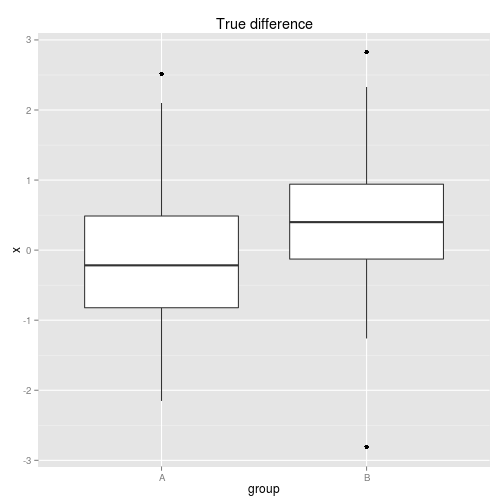
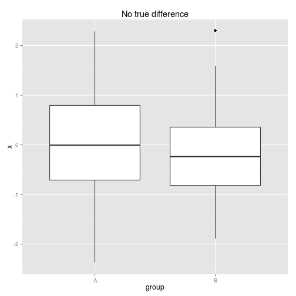
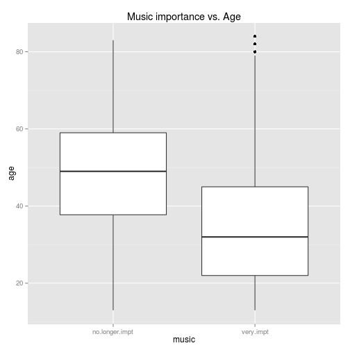
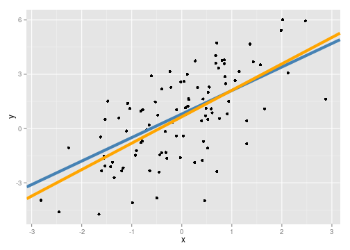
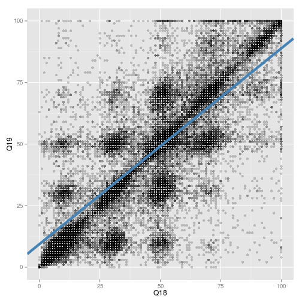

## Statistical Inference

# Goal: Test scientific claim and quantify our uncertainty about it.

+ Comparing means between groups: the $t$-test.
    - $p$-values
    - Confidence intervals
+ Associating quantitative variables.
    - Linear regression

All the code for this presentation is available [here](https://github.com/krisrs1128/intro-to-testing)

---
# Comparing means

- We have two samples with numerical measurements.
- We want to see whether the mean of one is significantly larger than another.


```r
X.true.diff[1:3, ]
```

```
##         x group
## 1  0.9232     A
## 2 -0.7360     A
## 3  0.8210     A
```

```r
summary(X.true.diff)
```

```
##        x          group 
##  Min.   :-2.484   A:50  
##  1st Qu.:-0.401   B:50  
##  Median : 0.163         
##  Mean   : 0.215         
##  3rd Qu.: 0.801         
##  Max.   : 3.007
```

---

Simulated data with true difference in means:


---

Simulated data with no difference in means:



--- 
## $t$-test

To quantitatively assess the difference in means, calculate
$$t = \frac{\bar{X}_{A} - \bar{X}_{B}}{\sqrt{Var{X}}}.$$

- $\bar{X}_{groups}$ is the mean in that group
-  $Var{Z}$ is the sample variance, 
a measure of the "spread" of that group.

If, there is no difference between the groups, we know the 
distribution of $t$, as long as a few extra assumptions hold, 
- The variances between the two groups are similar.
- Different samples are independent of each other.
- Data are close to normal (bell-shaped).

---
## Application to previous data


```r
# True difference
t.test(x ~ group, data = X.true.diff)
```

```
## 
## 	Welch Two Sample t-test
## 
## data:  x by group
## t = -2.627, df = 97.87, p-value = 0.01001
## alternative hypothesis: true difference in means is not equal to 0
## 95 percent confidence interval:
##  -0.8545 -0.1190
## sample estimates:
## mean in group A mean in group B 
##        -0.02875         0.45801
```

---


```r
# No true difference
t.test(x ~ group, data = X.no.diff)
```

```
## 
## 	Welch Two Sample t-test
## 
## data:  x by group
## t = 1.06, df = 96.88, p-value = 0.2919
## alternative hypothesis: true difference in means is not equal to 0
## 95 percent confidence interval:
##  -0.1809  0.5954
## sample estimates:
## mean in group A mean in group B 
##         0.04047        -0.16678
```

--- 
## Interpretation

+ $p$-value: The probability of a false positive.
+ Confidence interval: If we repeat the experiment, this interval 
  will contain the true difference in means with 95% probability.

--- 

# Real world example

Data from the [EMI music hackathon](https://www.kaggle.com/c/MusicHackathon).



---


```r
t.test(age ~ music, data = users.impt)
```

```
## 
## 	Welch Two Sample t-test
## 
## data:  age by music
## t = 35.25, df = 1960, p-value < 2.2e-16
## alternative hypothesis: true difference in means is not equal to 0
## 95 percent confidence interval:
##  12.49 13.96
## sample estimates:
## mean in group no.longer.impt      mean in group very.impt 
##                        47.32                        34.09
```

---

## Linear Regression

- What is the formula for the linear relationship
between variables? (red is truth, blue is estimate)



---

## Application to previous data

- The interpretation of $p$-values and confidence intervals remains the same.
- We also have estimates of the slope and intercept for the above line.


```r
XY.model <- lm(y ~ x, data = XY)
summary(XY.model)
```

```
## 
## Call:
## lm(formula = y ~ x, data = XY)
## 
## Residuals:
##    Min     1Q Median     3Q    Max 
##  -5.61  -1.18   0.21   1.18   4.56 
## 
## Coefficients:
##             Estimate Std. Error t value Pr(>|t|)    
## (Intercept)    1.108      0.306    3.63  0.00069 ***
## x              1.035      0.341    3.04  0.00383 ** 
## ---
## Signif. codes:  0 '***' 0.001 '**' 0.01 '*' 0.05 '.' 0.1 ' ' 1
## 
## Residual standard error: 2.15 on 48 degrees of freedom
## Multiple R-squared:  0.161,	Adjusted R-squared:  0.144 
## F-statistic: 9.24 on 1 and 48 DF,  p-value: 0.00383
```

---

```r
confint(XY.model)
```

```
##              2.5 % 97.5 %
## (Intercept) 0.4937  1.722
## x           0.3504  1.720
```

---

## Real world application
Users answered, on a scale of 0 to 100,
whether "I like to be at the cutting edge of 
new music" and "I like to know about music before
other people" (they also asked other questions).


--- 


```r
summary(lm(Q19 ~ Q18, data  = users))
```

```
## 
## Call:
## lm(formula = Q19 ~ Q18, data = users)
## 
## Residuals:
##    Min     1Q Median     3Q    Max 
## -86.11  -5.57  -0.57   5.80  93.43 
## 
## Coefficients:
##             Estimate Std. Error t value Pr(>|t|)    
## (Intercept)  5.72522    0.15499    36.9   <2e-16 ***
## Q18          0.84384    0.00314   269.1   <2e-16 ***
## ---
## Signif. codes:  0 '***' 0.001 '**' 0.01 '*' 0.05 '.' 0.1 ' ' 1
## 
## Residual standard error: 15.2 on 35518 degrees of freedom
##   (13125 observations deleted due to missingness)
## Multiple R-squared:  0.671,	Adjusted R-squared:  0.671 
## F-statistic: 7.24e+04 on 1 and 35518 DF,  p-value: <2e-16
```

---

The estimated regression line seems reasonable, but the $p$-values
should not be trusted, because the independence and linearity assumptions
seem violated. In this case, the regression model is useful for prediction, 
but not for testing.

Next steps, for those interested...

- Testing in categorical data (the $\chi^{2}$-test)
- Model assessment and diagnostics
- Confounding, and how to deal with it
- Doing inference when linear models fail: using the "bootstrap"

